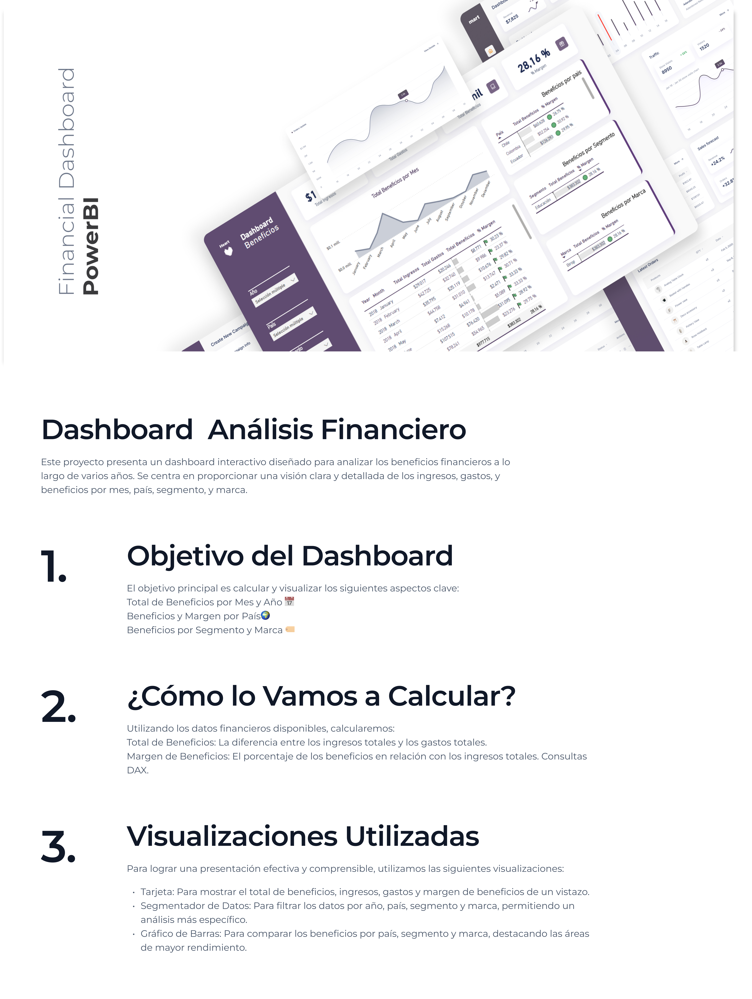

# 📊 Dashboard de Análisis Financiero
## Sobre el Proyecto

# 📊 Dashboard de Análisis Financiero

## Sobre el Proyecto
Este proyecto presenta un dashboard interactivo diseñado para analizar los beneficios financieros a lo largo de varios años. Se centra en proporcionar una visión clara y detallada de los ingresos, gastos, y beneficios por mes, país, segmento, y marca.

### 🚀 Objetivo del Dashboard
El objetivo principal es calcular y visualizar los siguientes aspectos clave:
- **Total de Beneficios por Mes y Año** 📅
- **Beneficios y Margen por País** 🌍
- **Beneficios por Segmento y Marca** 🏷️

Este proyecto presenta un dashboard interactivo diseñado para analizar los beneficios financieros a lo largo de varios años. Se centra en proporcionar una visión clara y detallada de los ingresos, gastos, y beneficios por mes, país, segmento, y marca.
### 🚀 Objetivo del Dashboard
El objetivo principal es calcular y visualizar los siguientes aspectos clave:
- **Total de Beneficios por Mes y Año** 📅
- **Beneficios y Margen por País** 🌍
- **Beneficios por Segmento y Marca** 🏷️
### 🛠️ ¿Cómo lo Vamos a Calcular?
Utilizando los datos financieros disponibles, calcularemos:
1. **Total de Beneficios**: La diferencia entre los ingresos totales y los gastos totales.
2. **Margen de Beneficios**: El porcentaje de los beneficios en relación con los ingresos totales.
### 📈 Visualizaciones Utilizadas
Para lograr una presentación efectiva y comprensible, utilizaremos las siguientes visualizaciones:
- **Tarjeta**: Para mostrar el total de beneficios, ingresos, gastos y margen de beneficios de un vistazo.
- **Segmentador de Datos**: Para filtrar los datos por año, país, segmento y marca, permitiendo un análisis más específico.
- **Gráfico de Barras**: Para comparar los beneficios por país, segmento y marca, destacando las áreas de mayor rendimiento.

## Link a la visualizacion [https://www.behance.net/gallery/207160871/Financial-PowerBi-Dashboard-Project
