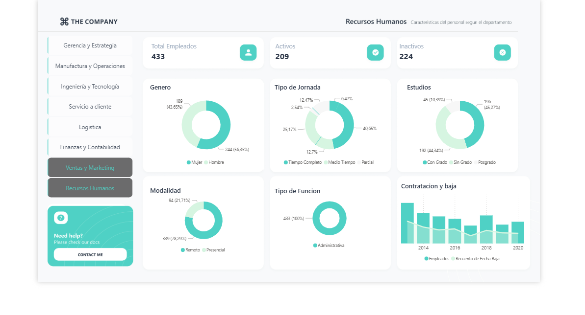

# HR Dashboard - Power BI

## 📌 Challenge
El equipo de Recursos Humanos enfrentaba dificultades para acceder y analizar los datos clave de manera eficiente.  
Los datos de contratación, rotación y headcount estaban dispersos en múltiples fuentes, lo que hacía que la toma de decisiones fuera lenta y propensa a errores.  
Además, no existía una guía de estilo estándar para la visualización de estos datos, lo que resultaba en inconsistencias visuales y en una experiencia de usuario deficiente.

## 🎯 Goal
Diseñar un dashboard interactivo en Power BI que centralizara todos los datos relevantes de Recursos Humanos en un solo lugar, permitiendo un análisis rápido y preciso.  
Además, crear una guía de estilo UI para estandarizar la apariencia y la funcionalidad del dashboard, mejorando la experiencia del usuario y la coherencia visual.

## 💡 Solution
Desarrollamos un dashboard en Power BI que incluye visualizaciones clave como:
- Tarjetas de KPIs  
- Gráficos de barras  
- Gráficos circulares  

Se implementaron medidas DAX avanzadas para cálculos precisos y filtros dinámicos para facilitar la exploración de datos.  

También se creó una **guía de estilo UI personalizada** en formato JSON, que define:
- Paleta de colores  
- Tipografía  
- Iconografía  
- Grilla de diseño  

Esto asegura una experiencia visual coherente y profesional, mejorando la interpretación de los datos y la toma de decisiones.

## 🔗 Live Dashboard
👉 [Ver en Power BI](https://app.powerbi.com/view?r=eyJrIjoiMDc4YWJmMTYtNWI4ZS00ZDNlLWFhMzUtYWQxNWQzMTdkZjY4IiwidCI6Ijc3N2ZhZTQyLTIxMGQtNDQxOS1iOWM1LWNkYTk4ZDAyMGUxNyIsImMiOjl9)

## 📊 Preview

-
HR-Dashboard/
│
├── assets/                # Capturas del dashboard (ej: dashboard_home.png)
├── style-guide/           # JSON con tema visual de Power BI
│   └── theme.json
├── data/                  # (opcional) dataset anonimizado si se puede compartir
└── README.md

## 🛠️ Tools & Technologies
- Power BI  
- DAX  
- JSON (theme)  

